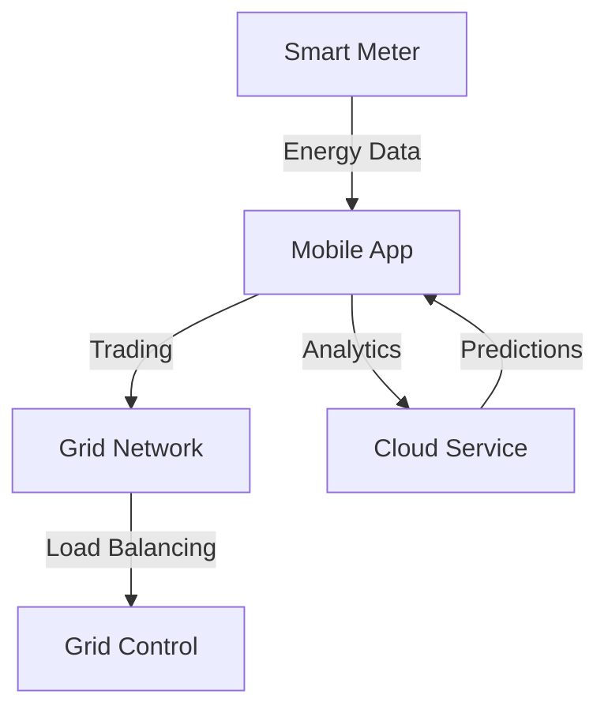
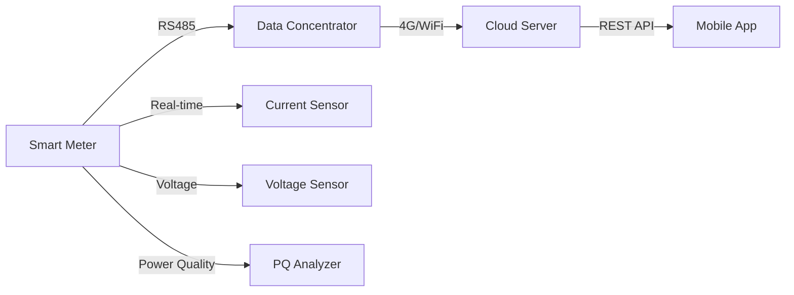
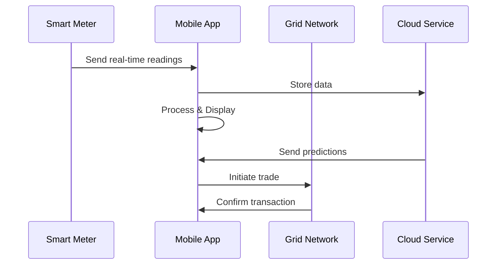
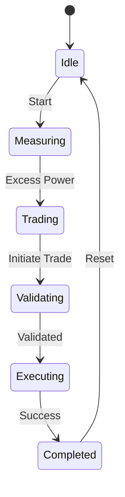

# TATA Smart Grid Mobile Application

<div align="center">
  
  <h3>Intelligent Energy Management & Trading Platform</h3>
</div>

## Table of Contents
- [Overview](#overview)
- [System Architecture](#system-architecture)
- [Hardware Requirements](#hardware-requirements)
- [Software Architecture](#software-architecture)
- [Calculations & Formulas](#calculations--formulas)
- [Data Flow](#data-flow)
- [Installation](#installation)
- [API Integration](#api-integration)

## Overview

The TATA Smart Grid application enables real-time energy monitoring, trading, and intelligent grid management. The system connects smart meters with mobile devices to provide instant energy usage insights and facilitate peer-to-peer energy trading.



## System Architecture

### Hardware Components


### Required Hardware Data Points
1. **Smart Meter Readings**
   - Voltage (V): 220-240V AC
   - Current (A): 0-100A
   - Power Factor: 0.8-1.0
   - Frequency (Hz): 49.5-50.5Hz
   - Active Power (kW)
   - Reactive Power (kVAR)
   - Apparent Power (kVA)

2. **Power Quality Parameters**
   - THD (Total Harmonic Distortion)
   - Voltage sags/swells
   - Frequency variations
   - Power factor deviations

3. **Environmental Data**
   - Temperature: -10°C to 60°C
   - Humidity: 0-95% RH
   - Grid stability index

## Calculations & Formulas

### 1. Power Calculations
```python
# Active Power (P)
P = V * I * cos(φ)  # V=voltage, I=current, φ=phase angle

# Reactive Power (Q)
Q = V * I * sin(φ)

# Apparent Power (S)
S = V * I

# Power Factor (PF)
PF = P / S
```

### 2. Energy Trading Calculations
```python
# Trading Rate
base_rate = 3.80  # ₹/kWh
peak_hour_rate = base_rate * 1.5
off_peak_rate = base_rate * 0.8

# Earnings Calculation
hourly_earnings = units_traded * current_rate
daily_projection = hourly_earnings * 24
```

### 3. Tariff Calculations
```python
# Slab-based Billing
def calculate_bill(units):
    if units <= 100:
        return units * 3.50
    elif units <= 200:
        return (100 * 3.50) + ((units-100) * 4.00)
    else:
        return (100 * 3.50) + (100 * 4.00) + ((units-200) * 5.00)
```

## Data Flow

### Real-time Data Flow


### Trading Flow


## Installation

1. Hardware Setup
```bash
# Smart Meter Configuration
baudrate: 9600
parity: none
stopbits: 1
bytesize: 8
timeout: 1
```

2. Software Setup
```bash
# Flutter Installation
flutter pub get
flutter run --release
```

## API Integration

### Smart Meter API Endpoints
```json
{
  "endpoints": {
    "readings": "/api/v1/readings",
    "trading": "/api/v1/trade",
    "metrics": "/api/v1/metrics"
  },
  "data_format": {
    "voltage": "float",
    "current": "float",
    "power": "float",
    "timestamp": "ISO8601"
  }
}
```

### Required Hardware APIs
```java
// Real-time meter reading
GET /api/v1/readings
Response: {
  "voltage": 230.5,
  "current": 4.2,
  "power_factor": 0.92,
  "frequency": 50.0,
  "active_power": 892.4,
  "timestamp": "2024-02-20T15:30:00Z"
}

// Power quality metrics
GET /api/v1/quality
Response: {
  "thd": 2.3,
  "sags": 0,
  "swells": 0,
  "stability_index": 0.98
}
```

## Development Notes

1. **Modbus Communication Parameters**
   - Address: 1-247
   - Function codes: 03 (read), 06 (write)
   - Register map: 40001-49999

2. **Data Sampling Rates**
   - Power metrics: 1 sample/second
   - Quality metrics: 1 sample/minute
   - Trading data: On-demand

3. **Hardware Integration Requirements**
   - RS485/Modbus RTU support
   - TCP/IP connectivity
   - Real-time clock synchronization
   - Secure storage for credentials

4. **Error Handling**
   - Communication timeout: 3 retries
   - Data validation thresholds
   - Automatic failover mechanisms
