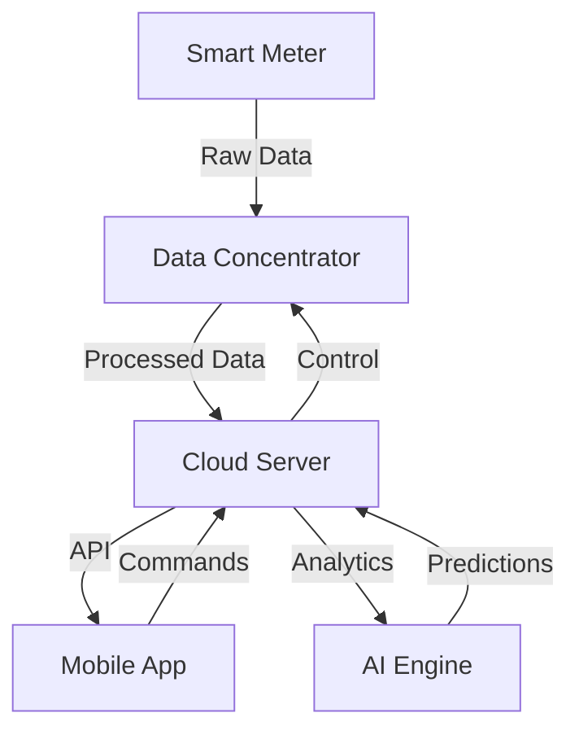

# TATA Smart Grid Mobile Application

<div align="center">
  <h3>Intelligent Energy Management & Trading Platform</h3>
</div>

## Table of Contents
- [Overview](#overview)
- [Hardware Requirements](#hardware-requirements)
- [Software Architecture](#software-architecture)
- [Technical Specifications](#technical-specifications)
- [Calculations & Formulas](#calculations--formulas)
- [Installation](#installation)
- [Usage](#usage)
- [Contributing](#contributing)
- [License](#license)

## Overview
TATA Smart Grid is an advanced energy management system that facilitates:
- Real-time power monitoring and analysis
- Peer-to-peer energy trading
- Automated load balancing
- Predictive maintenance
- Dynamic pricing optimization
- Smart meter integration
- Grid stability monitoring
- Power quality analysis

## Hardware Requirements

### Smart Meter Specifications
- Voltage Input: 230V AC ±20%
- Current Range: 5-100A
- Frequency: 50Hz ±5%
- Power Factor Range: 0.5 lag to 0.8 lead
- Accuracy Class: 1.0
- Communication: RS485/Modbus

Additional Features:
- Tamper Detection: Magnetic & Physical
- Memory: 256KB non-volatile
- Real-time Clock Accuracy: ±5 ppm
- Display: LCD with 8 digits
- Surge Protection: 6kV/3kA
- Temperature Range: -25°C to 75°C
- Humidity Range: 5% to 95% RH
- Measurement Parameters:
  * kWh (Import/Export)
  * kVARh (Import/Export)
  * Maximum Demand
  * Phase Voltages
  * Phase Currents
  * Power Factor per Phase
  * Frequency

### Data Concentrator Unit (DCU)
- Processor: ARM Cortex-M4 or higher 
- Memory: 256KB RAM minimum
- Storage: 4GB minimum
- Connectivity: 4G LTE/WiFi/Ethernet
- Operating Temperature: -20°C to 60°C
- Power Supply: 12V DC

### Current Sensors
- Type: Split Core CT
- Current Range: 0-120A
- Output: 0-5V DC
- Accuracy: ±1%
- Response Time: <100ms

### Voltage Sensors
- Input: 0-300V AC
- Output: 0-5V DC
- Sampling Rate: 2kHz
- Isolation: 3kV

### Power Quality Analyzer
- THD Measurement: Up to 50th harmonic
- Sag/Swell Detection: ±10% nominal
- Flicker Measurement: Pst, Plt
- Data Logging: 1 minute intervals

### Communication Protocols
- Primary: Modbus RTU over RS485
- Secondary: Wireless M-Bus
- Backup: Optical Port
- Data Format: ASCII/HEX
- Baud Rate: 300-19200 bps
- Error Checking: CRC-16
- Frame Format: 8N1/8E1

### Grid Integration Requirements
- Protection Class: IP54
- Grid Synchronization Time: <100ms
- Fault Recording: Last 10 events
- Load Profile Recording: 45 days
- Data Resolution: 15-minute intervals
- Backup Power: 72-hour lithium battery
- Auto-reconnect Feature: Programmable 0-60 minutes

## Technical Specifications

### Desired Operating Parameters
- Voltage: 230V ±5%
- Frequency: 50Hz ±0.5Hz
- Power Factor: >0.95
- THD: <5%
- Phase Imbalance: <2%

### Critical Thresholds
```
Voltage Deviation: ±10%
Frequency Range: 49.5-50.5 Hz
Maximum Current: 100A per phase
Power Factor Minimum: 0.85
Maximum THD: 8%
```

### Power Quality Monitoring
Detailed Parameters:
```
Voltage Sags: Duration 10ms-3min
            Depth 10-90%
Voltage Swells: Duration 10ms-3min
              Height 110-180%
Interruptions: Duration >3min
Transients: 5kHz-2MHz
Harmonics: Up to 50th order
          Individual & Total
Flicker: Pst (10 min)
         Plt (2 hours)
```

### Grid Stability Metrics
```
Frequency Response:
- Rate of Change (ROCOF): ±2 Hz/s
- Vector Shift: ±10 degrees
- Phase Angle: ±180 degrees

Voltage Stability:
- Steady State: ±5% nominal
- Dynamic: ±10% recovery in 1s
- Step Response: <40ms

Current Stability:
- Maximum Imbalance: 10%
- Inrush Current: 6x nominal
- Short Circuit Rating: 10kA
```

## Calculations & Formulas

### Power Calculations
```
Active Power (P) = V * I * cos(φ)
Reactive Power (Q) = V * I * sin(φ)
Apparent Power (S) = V * I
Power Factor (PF) = P/S
```

### Efficiency Metrics
```
Grid Efficiency = (Energy Delivered / Energy Input) * 100
Line Loss = ((Input Power - Output Power) / Input Power) * 100
Load Factor = (Average Load / Peak Load) * 100
```

### Power Quality Indices
```
Voltage THD = √(∑Vh²)/V1 * 100
Current THD = √(∑Ih²)/I1 * 100
Voltage Unbalance = (Max Deviation / Average) * 100
```

### Energy Trading Calculations
```
Trading Price = Base Rate * (1 + Demand Factor) * Time Factor
Demand Factor = Current Load / Maximum Load
Time Factor = Peak Hours ? 1.5 : 1.0
```

### Advanced Calculations

#### Power Quality Analysis
```
Individual Harmonic Distortion (IHD):
IHD(n) = (Vn/V1) * 100%
where: 
- Vn is voltage magnitude at nth harmonic
- V1 is fundamental voltage magnitude

Voltage Crest Factor:
CF = Vpeak / Vrms

K-Factor for Transformers:
K = ∑(Ih² * h²) / ∑(Ih²)
where:
- Ih is harmonic current
- h is harmonic order
```

#### Load Analysis Formulas
```
Dynamic Load Index:
DLI = (ΔP/ΔV) * (V/P)

Voltage Stability Index:
VSI = |V|⁴ - 4(P² + Q²)Z²

Loss Sensitivity Factor:
LSF = ∂Ploss/∂P
```

#### Energy Trading Algorithms
```
Real-time Pricing:
Price = BaseRate * LoadFactor * TimeOfDay * GridStability

where:
LoadFactor = CurrentLoad/PeakLoad
TimeOfDay = PeakHours ? 1.5 : 1.0
GridStability = 1 + (FreqDeviation/0.5)

Trading Priority:
Priority = (AvailableCapacity/MaxCapacity) * 
          (1/Distance) * 
          ReputationScore * 
          ReliabilityIndex
```

## Installation

### Hardware Setup
1. Install smart meters at consumption points
2. Connect CTs and VTs to measurement points
3. Install DCU and configure communication
4. Verify network connectivity
5. Calibrate sensors and verify readings

### Software Setup
1. Clone repository
2. Install dependencies:
```bash
flutter pub get
```
3. Configure environment:
```bash
cp .env.example .env
```
4. Build application:
```bash
flutter build apk --release
```

## Usage
The application requires proper hardware setup and calibration before use. Ensure all sensors are properly installed and communicating before deploying the application.

### Device Support
- Android 6.0 (API 23) or higher
- iOS 11.0 or higher
- 2GB RAM minimum
- 100MB storage space

## Software Architecture

### Data Flow Architecture


### Security Implementation
- Authentication: JWT with biometric verification
- Encryption: AES-256 for data at rest
- Transport: TLS 1.3
- Key Management: HSM integration
- Access Control: Role-based (RBAC)
- Audit Logging: Blockchain-based

## Development Environment

### Required Tools
```
Flutter SDK: 3.0.0 or higher
Dart: 2.17 or higher
Android Studio: 2021.2.1 or higher
Xcode: 13.0 or higher (for iOS)
VS Code Extensions:
- Flutter
- Dart
- REST Client
- Database Tools
```

### Development Dependencies
```yaml
dependencies:
  flutter_bloc: ^8.0.0
  dio: ^4.0.0
  hive: ^2.0.0
  mqtt_client: ^9.0.0
  fl_chart: ^0.40.0
  json_serializable: ^6.0.0
```

## API Integration

### Endpoints
```
Base URL: https://api.smartgrid.tata.com/v1

Authentication:
POST /auth/login
POST /auth/refresh
POST /auth/biometric

Monitoring:
GET /metrics/realtime
GET /metrics/historical
GET /alerts
GET /power-quality

Trading:
POST /trade/offer
GET /trade/marketplace
PUT /trade/accept
DELETE /trade/cancel
```

## Error Handling

### Hardware Errors
```
Error Codes:
1xx: Communication Errors
2xx: Measurement Errors
3xx: Hardware Failures
4xx: Configuration Errors
5xx: System Errors

Recovery Procedures:
- Automatic retry (3 attempts)
- Failover to backup communication
- Data buffering during outages
- Automatic recalibration
```

## Performance Metrics

### Response Times
```
Real-time Data: <100ms
Historical Query: <500ms
Trading Operations: <1s
Alert Generation: <200ms
UI Updates: 60fps
```

## Maintenance

### Calibration Schedule
```
Daily: Zero-point calibration
Weekly: Gain calibration
Monthly: Full system calibration
Quarterly: Certification check
```

## Contributing
This is a proprietary project. No external contributions are accepted.

## License
All rights reserved. This is proprietary software.

Copyright © 2024 TATA Smart Grid
All rights reserved.

This software and associated documentation are proprietary and confidential.
